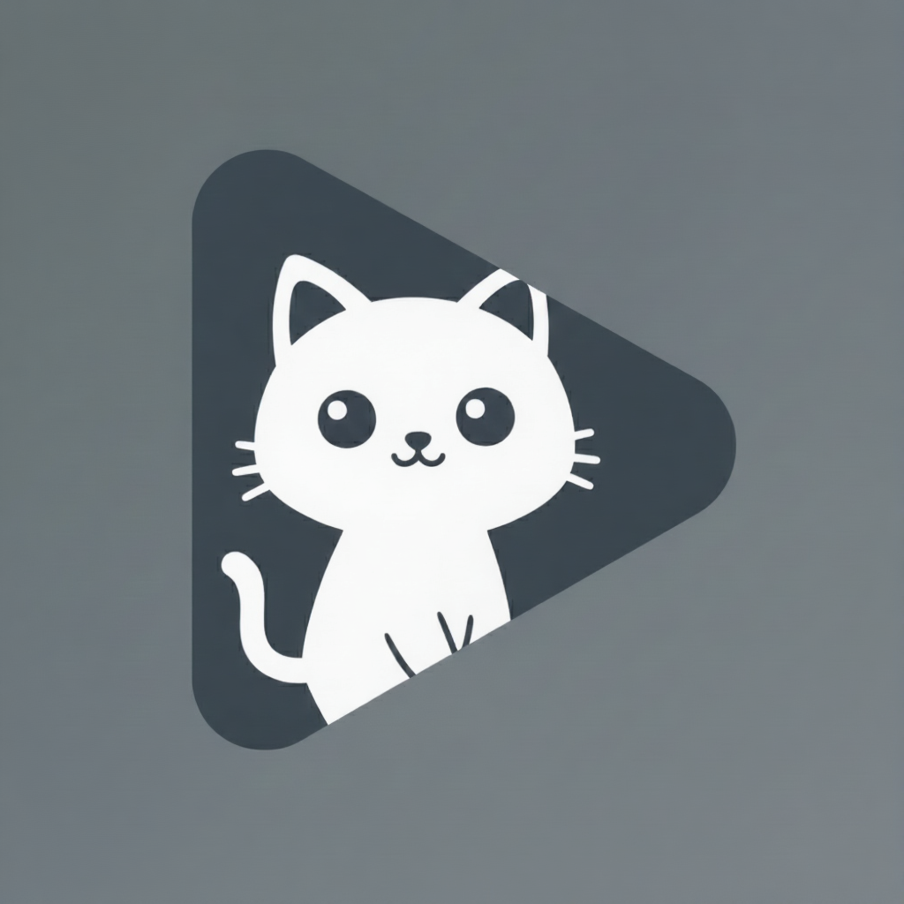
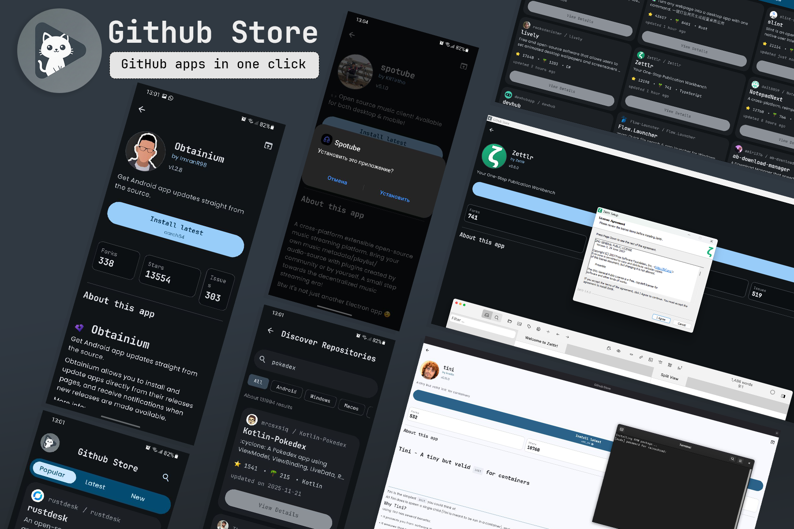
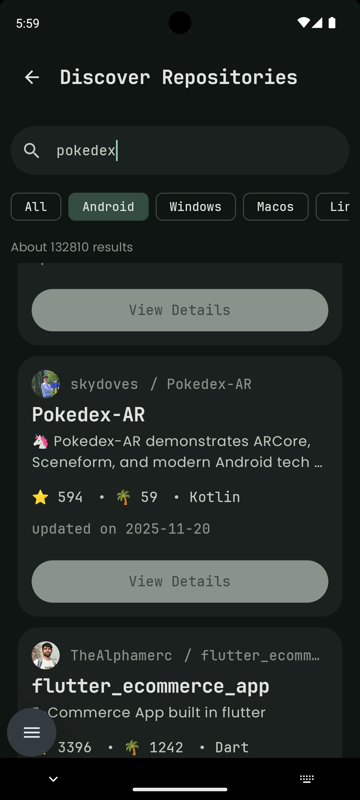
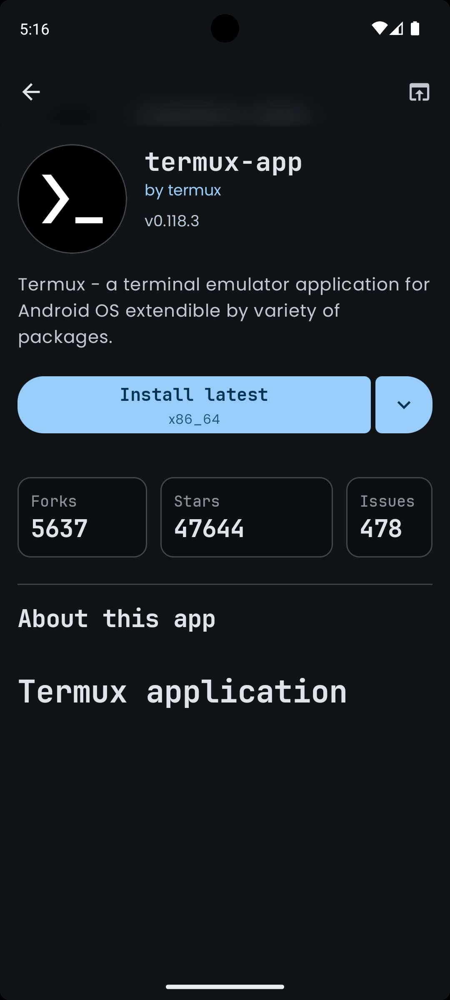
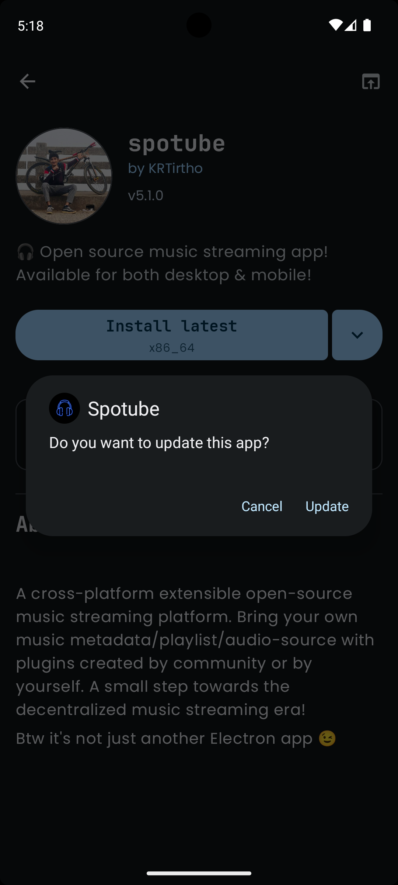
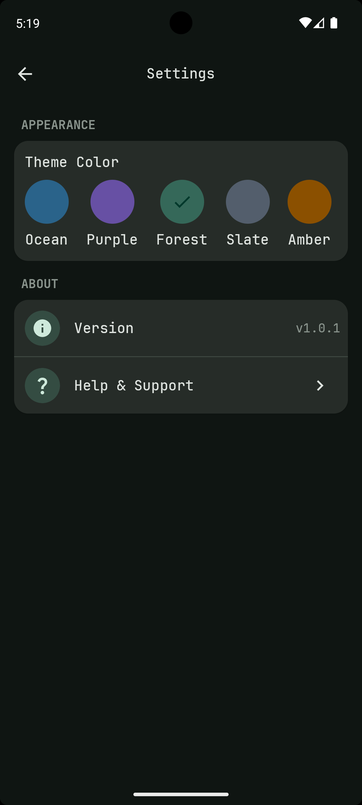
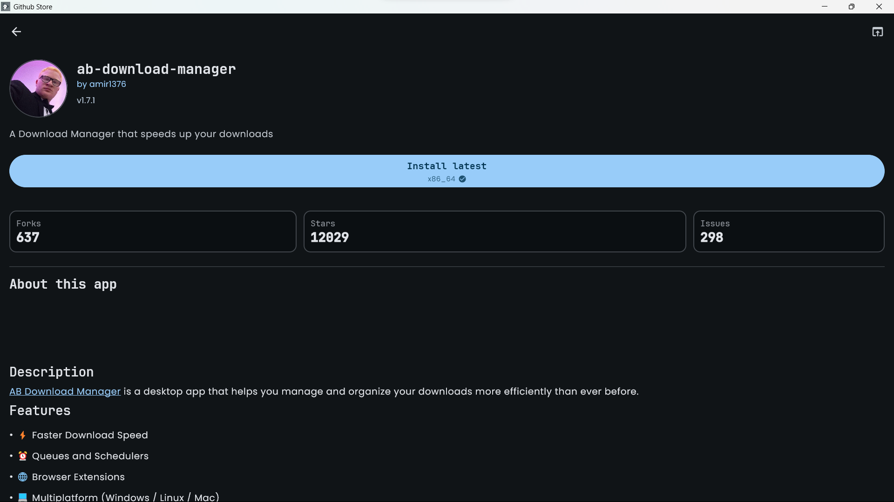
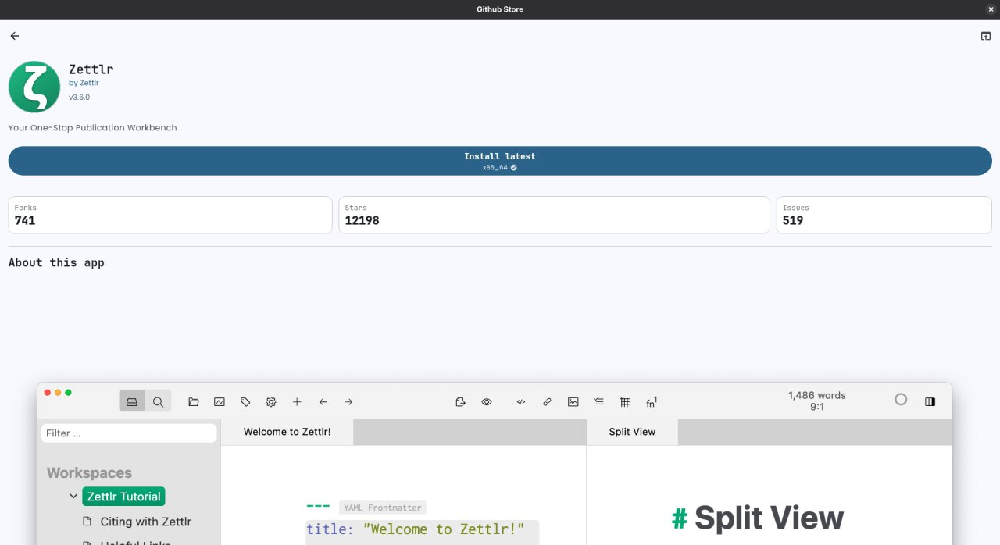

 

# Kiri Store

 

 

### 🗺️ Project Overview

**Kiri Store** is a premium, cross-platform app store built for the GitHub ecosystem. It simplifies the process of discovering, installing, and updating open-source software by automatically detecting compatible binaries for your platform.

Built with **Kotlin Multiplatform** and **Compose Multiplatform**, offering a native experience on both **Android** and **Desktop** (Windows, macOS, Linux).

---

  

  <table style="width:100%">
    <tr>
      <td width="24%"></td>
      <td width="24%"></td>
      <td width="24%"></td>
      <td width="24%"></td>
    </tr>
  </table>

---

## 🚀 Key Features

- **💎 Premium UI/UX**
    - Material You dynamic theming and "Liquid Glass" effects.
    - Smooth transitions and expressive motion design.
    - Dark mode, AMOLED black, and custom accent colors.

- **🔍 Smart Discovery**
    - **Curated Feeds**: "Trending", "Hot Releases", and "Most Popular" with smart filters.
    - **Platform-Aware**: Automatically prioritizes apps compatible with your current device.
    - **Deep Search**: Filter by language, platform, and sort order.
    - **Clipboard Detection**: Paste a GitHub URL to instantly view app details.

- **📦 Effortless Installation**
    - **One-Click Install**: Detects APK, EXE, DMG, AppImage, DEB, and RPM.
    - **Release Picker**: Browse and install any previous version of an application.
    - **Shizuku Support**: Silent, background installations and updates on Android.

- **🛠️ App Management**
    - **Update Tracking**: Automatically checks for updates in the background.
    - **Installed Apps**: Open, uninstall, or downgrade apps directly.
    - **Link Apps**: Connect existing apps on your device to their GitHub repos for update tracking.

- **🌐 Network & Performance**
    - **Proxy Support**: Configure HTTP/SOCKS proxies with authentication.
    - **Smart Caching**: Fast loading with minimal API consumption.
    - **Localized**: Available in 13+ languages.

---

## 🖥️ Desktop Experience

Kiri Store provides a first-class experience on Windows, macOS, and Linux.

  
  

---

## 📥 Download & Install

> [!IMPORTANT]
> **macOS Users:** If you see a "unverified developer" warning, allow it via **System Settings** → **Privacy & Security** → **Open Anyway**.

---

## 🔍 For Developers: How to appear in Kiri Store?

Your project will appear automatically if it meets these simple criteria:
1. **Public Repository** on GitHub.
2. **Release Assets**: Include binaries like `.apk`, `.exe`, `.dmg`, `.AppImage`, etc.
3. **Discoverability**: Add relevant topics like `android`, `windows`, `desktop`, or `linux`.

---

## 🔐 Security & Privacy

- **Safe Signing**: All official releases are signed with our verified certificate.
- **Local First**: Your favorites, history, and settings are stored safely on your device.
- **Open Source**: Transparent codebase that anyone can audit and contribute to.

---

## 💬 Community & Support

- **Wiki**: [FAQ & Documentation](https://github.com/kriss2012/Kiri-Store/wiki)
- **WhatsApp**: [Join our Community](https://chat.whatsapp.com/EXAMPLE_LINK)
- **Email**: [krishna@email.com](mailto:krishna@email.com)

---

⭐ **Love Kiri Store? Give it a star!** ⭐

---

## 📄 License

Copyright 2025 kriss2012. Released under the **Apache License, Version 2.0**.
